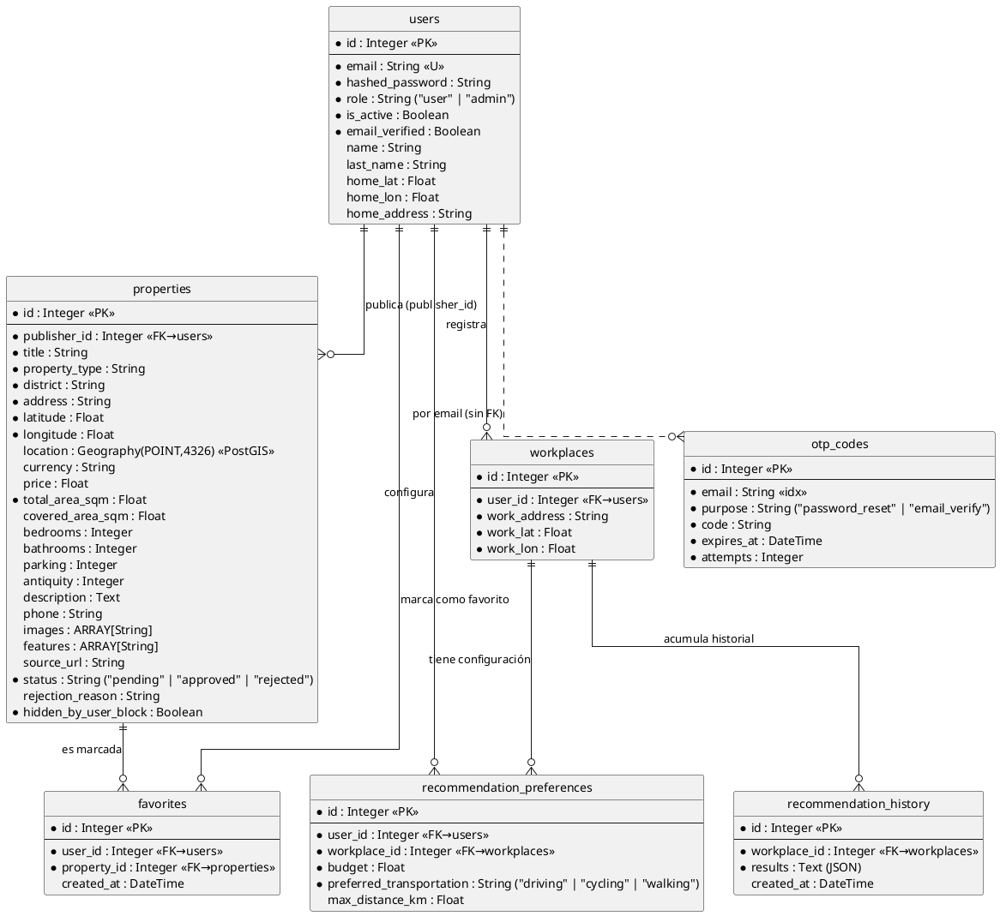
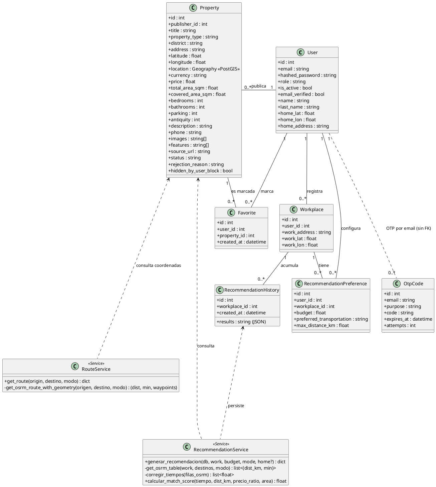

# Arquitectura Backend — MiCasita

Documento de referencia con los diagramas C4 actualizados al estado real del sistema.

---

## Resumen de la arquitectura actual

- **API**: Python + FastAPI con 8 routers (`auth`, `workplaces`, `properties`, `recommendation_preferences`, `admin`, `geocode`, `recommend`, `route`).
- **Base de datos**: PostgreSQL con extensión **PostGIS** para consultas espaciales (`ST_DWithin`, `ST_Distance`, `Geography(POINT,4326)`).
- **Machine Learning**: XGBoost (regresión) corrige el tiempo de flujo libre de OSRM al tiempo real con tráfico (entrenado contra TomTom). `match_score` **no es un modelo**: es una función de utilidad explícita (tiempo ya corregido + presupuesto + distancia + área).
- **Routing**: OSRM propio, autohospedado, con el grafo recortado a Lima Metropolitana (una instancia por modo: auto, bicicleta, a pie). Completamente centralizado en el backend — la app móvil nunca llama a OSRM directamente, ni para tiempos ni para la geometría del mapa. `/table` puntúa todas las candidatas de una recomendación en una sola consulta; `/route` resuelve bajo demanda el tiempo corregido y la geometría de una vivienda seleccionada.
- **Geocoding**: TomTom (primario, con recuadro de Lima) → Nominatim → Photon (fallbacks en cascada).
- **Imágenes**: Cloudinary (subida desde el backend vía API; URLs públicas almacenadas en `ARRAY(String)`).
- **Emails**: SendGrid (API v3) para emails transaccionales: verificación de correo por OTP al registrarse, recuperación de contraseña por OTP y notificaciones de aprobación/rechazo de propiedades.
- **OTP**: códigos de 6 dígitos de un solo uso, **persistidos en PostgreSQL** (tabla `otp_codes`) con expiración por `expires_at` (15 min para reset de contraseña, 24 h para verificación de correo) y límite de **5 intentos** (`attempts`) antes de invalidarse.
- **Seguridad de sesión**: bloquear un usuario (`is_active = false`) corta el acceso en el acto — se revisa en cada request autenticado, no solo en el login.
- **Visibilidad de propiedades**: una vivienda `pending` o `rejected` solo la puede ver su propio publicador o un admin; para cualquier otro (incluso sin sesión) responde 404, igual que si no existiera.

---

## 1. Context Diagram

```plantuml
@startuml
!include https://raw.githubusercontent.com/plantuml-stdlib/C4-PlantUML/master/C4_Context.puml

LAYOUT_WITH_LEGEND()

Person(user, "Usuario Final", "Inquilino o comprador que busca vivienda cerca de su trabajo.")
Person(admin, "Administrador", "Modera y gestiona el inventario de propiedades publicadas.")

System_Boundary(c1, "Sistema MiCasita") {
    System(micasita, "Plataforma MiCasita", "Búsqueda inteligente de viviendas con IA. Filtra por presupuesto, distancia y tiempo de trayecto al trabajo.")
}

System_Ext(osm, "OpenStreetMap", "Tiles de mapa para la visualización.")
System_Ext(osrm, "OSRM Engine", "Calcula rutas y tiempos reales (auto, bicicleta, a pie).")
System_Ext(geocoding, "Nominatim / Photon", "Geocodificación de direcciones (primario + fallback).")
System_Ext(cloudinary, "Cloudinary", "Almacenamiento y CDN de imágenes de propiedades.")
System_Ext(sendgrid, "SendGrid", "Envío de emails transaccionales (OTP de verificación, reset de contraseña, aprobación/rechazo de propiedades).")

Rel(user, micasita, "Busca viviendas y visualiza rutas", "HTTPS / App Móvil")
Rel(admin, micasita, "Modera propiedades", "HTTPS / REST API")

Rel(micasita, osm, "Descarga tiles de mapa", "HTTPS")
Rel(micasita, osrm, "Consulta tiempos y geometrías de rutas", "HTTPS")
Rel(micasita, geocoding, "Geocodifica y autocompleta direcciones", "HTTPS")
Rel(micasita, cloudinary, "Sube y sirve imágenes de propiedades", "HTTPS API")
Rel(micasita, sendgrid, "Envía emails transaccionales (OTP, notificaciones)", "HTTPS API")

@enduml
```

---

## 2. Container Diagram

```plantuml
@startuml
!include https://raw.githubusercontent.com/plantuml-stdlib/C4-PlantUML/master/C4_Container.puml

LAYOUT_WITH_LEGEND()

Person(user, "Usuario Final", "Inquilino o comprador.")
Person(admin, "Administrador", "Gestor de propiedades.")

System_Boundary(micasita_system, "Sistema MiCasita") {
    Container(mobile_app, "Mobile App", "React Native / Expo / TypeScript", "Interfaz móvil: búsqueda de propiedades, visualización de rutas multi-modo y wizard de publicación. Nunca llama a OSRM directamente.")
    Container(api_app, "API Application", "Python / FastAPI", "Autenticación JWT, filtros espaciales PostGIS, ruteo OSRM centralizado (batch + bajo demanda), corrección de tiempo con XGBoost y moderación de contenido.")
    ContainerDb(db, "Database", "PostgreSQL + PostGIS", "Usuarios, propiedades (con columna Geography), workplaces, preferencias e historial de recomendaciones.")
}

System_Ext(osm, "OpenStreetMap", "Map Tiles")
System_Ext(osrm, "OSRM Engine", "Routing Engine propio (car / bicycle / foot), grafo recortado a Lima")
System_Ext(geocoding, "TomTom / Nominatim / Photon", "Geocoding APIs (cascada de fallbacks)")
System_Ext(cloudinary, "Cloudinary", "Image CDN")
System_Ext(sendgrid, "SendGrid", "Email Service (API v3)")

Rel(user, mobile_app, "Interactúa con", "UI")
Rel(admin, mobile_app, "Modera propiedades", "UI")

Rel(mobile_app, api_app, "Consulta propiedades, recomendaciones, preferencias y rutas", "HTTPS / JSON")
Rel(mobile_app, osm, "Descarga tiles de mapa", "HTTPS")

Rel(api_app, db, "Lee y escribe datos", "SQLAlchemy ORM / PostGIS")
Rel(api_app, osrm, "Batch /table para candidatas + /route bajo demanda (tiempo y geometría)", "HTTPS")
Rel(api_app, geocoding, "Geocodifica direcciones (TomTom → Nominatim → Photon)", "HTTPS")
Rel(api_app, cloudinary, "Sube imágenes de propiedades", "HTTPS API")
Rel(api_app, sendgrid, "Envía OTP, reset de contraseña y notificaciones", "HTTPS API")

@enduml
```

---

## 3. Component Diagram (Backend API)

```plantuml
@startuml
!include https://raw.githubusercontent.com/plantuml-stdlib/C4-PlantUML/master/C4_Component.puml

LAYOUT_WITH_LEGEND()

Container(mobile, "Aplicación Móvil", "React Native", "Interfaz multiplataforma. Nunca llama a OSRM directamente.")
ContainerDb(db, "PostgreSQL + PostGIS", "SQL Database", "Persistencia con soporte espacial (Geography, ST_DWithin).")
System_Ext(osrm, "OSRM Engine", "Motor de rutas propio por modo de transporte, grafo recortado a Lima.")
System_Ext(geocoding, "TomTom / Nominatim / Photon", "Geocodificadores en cascada.")
System_Ext(cloudinary, "Cloudinary", "CDN y almacenamiento de imágenes.")
System_Ext(sendgrid, "SendGrid", "Servicio de email transaccional (API v3).")

Container_Boundary(api_app, "API Application (FastAPI)") {

    Component(main, "Main App", "FastAPI", "Punto de entrada. Registra routers, CORS y middleware.")

    Component(auth_router, "Auth Controller", "API Router /auth", "Registro (con reintento si el correo previo nunca se verificó), login OAuth2 (form-data), JWT y perfil. Verificación de correo por OTP, reenvío y recuperación de contraseña (OTP persistido en otp_codes, con límite de intentos).")

    Component(workplaces_router, "Workplaces Controller", "API Router /workplaces", "CRUD de lugares de trabajo del usuario con validación de Lima.")

    Component(properties_router, "Properties Controller", "API Router /properties", "Feed público (solo approved), CRUD de propiedades con validación de Lima al crear/editar, upload a Cloudinary y gestión de favoritos. El detalle de una vivienda pending/rejected solo lo ve su publicador o un admin.")

    Component(prefs_router, "Preferences Controller", "API Router /recommendation_preferences", "Configura presupuesto, transporte y radio máximo por workplace.")

    Component(admin_router, "Admin Controller", "API Router /admin", "Aprobación/rechazo de propiedades y gestión de usuarios. Dispara emails vía SendGrid.")

    Component(geocode_proxy, "Geocode Proxy", "API Router /geocode", "Proxy con caché en memoria para autocompletar direcciones en la app. Nominatim primario, cae a Photon en error.")

    Component(recommend_router, "Recommend Controller", "API Router /recommend", "Pre-filtro PostGIS → batch OSRM /table para todas las candidatas → corrección de tiempo (XGBoost) → match_score (función de utilidad explícita) → cálculo de time_saved. Guarda historial validado (import-results verifica que cada vivienda referenciada exista y esté approved).")

    Component(route_router, "Route Controller", "API Router /route", "Único punto de ruteo bajo demanda para el mapa: tiempo corregido + geometría de una vivienda seleccionada. Degrada a estimación por Haversine si OSRM falla.")

    Component(travel_time_predictor, "Travel Time Predictor", "ml_pipeline/predictor_travel_time.py (XGBoost)", "Corrige el tiempo de flujo libre de OSRM al tiempo real con tráfico, a partir de (osrm_min, modo, hora, geografía relativa a Lima). Entrenado contra TomTom. Modelo (.json) y features (.pkl) de ml_pipeline/model/ cargados una vez al inicio.")

    Component(db_comp, "Database Layer", "SQLAlchemy ORM", "Sesiones, modelos y queries espaciales PostGIS.")
}

Rel(mobile, main, "Peticiones REST", "HTTPS/JSON")

Rel(main, auth_router, "Enruta /auth")
Rel(main, workplaces_router, "Enruta /workplaces")
Rel(main, properties_router, "Enruta /properties")
Rel(main, prefs_router, "Enruta /recommendation_preferences")
Rel(main, admin_router, "Enruta /admin")
Rel(main, geocode_proxy, "Enruta /geocode")
Rel(main, recommend_router, "Enruta /recommend")
Rel(main, route_router, "Enruta /route")

Rel(geocode_proxy, geocoding, "Consulta dirección (Nominatim primario, Photon fallback)", "HTTPS")

Rel(recommend_router, osrm, "Tiempo y distancia de todas las candidatas en una sola consulta batch", "HTTPS")
Rel(recommend_router, travel_time_predictor, "Corrige el tiempo de las candidatas resueltas por OSRM real")
Rel(recommend_router, db_comp, "ST_DWithin pre-filtro + historial")

Rel(route_router, osrm, "Tiempo + geometría de una vivienda", "HTTPS")
Rel(route_router, travel_time_predictor, "Corrige el tiempo antes de responder")

Rel(properties_router, cloudinary, "Sube imagen de propiedad", "HTTPS API")
Rel(properties_router, db_comp, "CRUD propiedades y favoritos")

Rel(admin_router, sendgrid, "Notifica aprobación/rechazo al publicador", "HTTPS API")
Rel(admin_router, db_comp, "Cambia status, oculta propiedades")

Rel(auth_router, db_comp, "Valida credenciales y is_active, persiste/valida OTP (otp_codes) con límite de intentos, marca email_verified y actualiza perfil")
Rel(auth_router, sendgrid, "Envía OTP de verificación y reset", "HTTPS API")
Rel(workplaces_router, db_comp, "CRUD workplaces")
Rel(prefs_router, db_comp, "CRUD preferencias")

Rel(db_comp, db, "Queries SQL / PostGIS", "TCP")

@enduml
```

---

## 4. Diagrama Entidad-Relación (Base de Datos)



---

## 5. Diagrama de Clases (Dominio)


